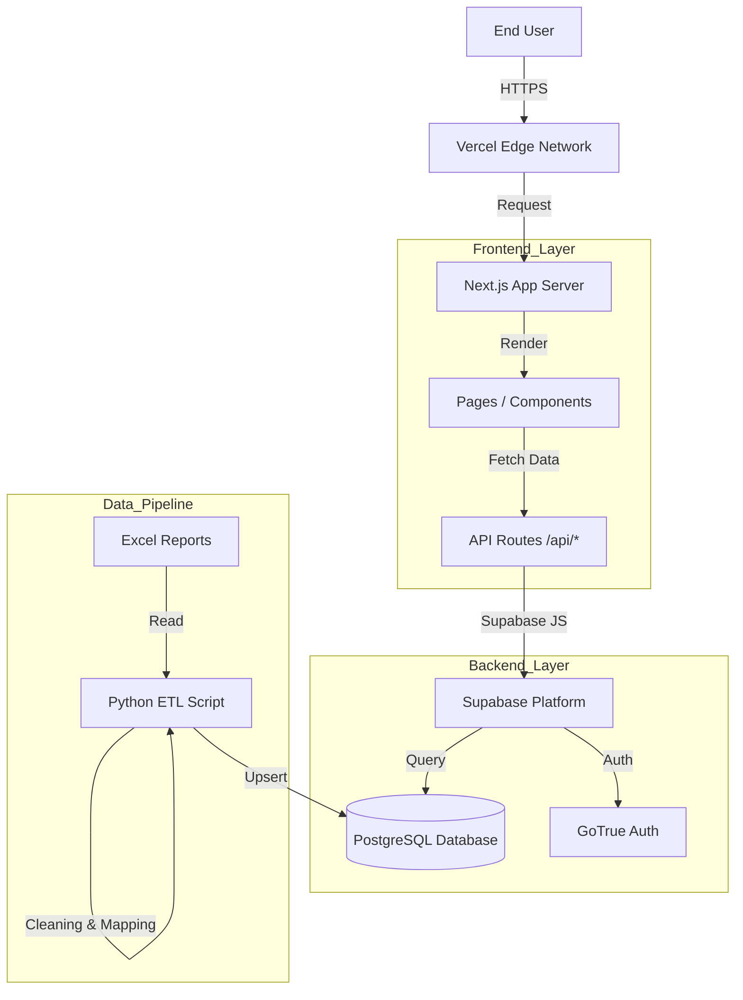
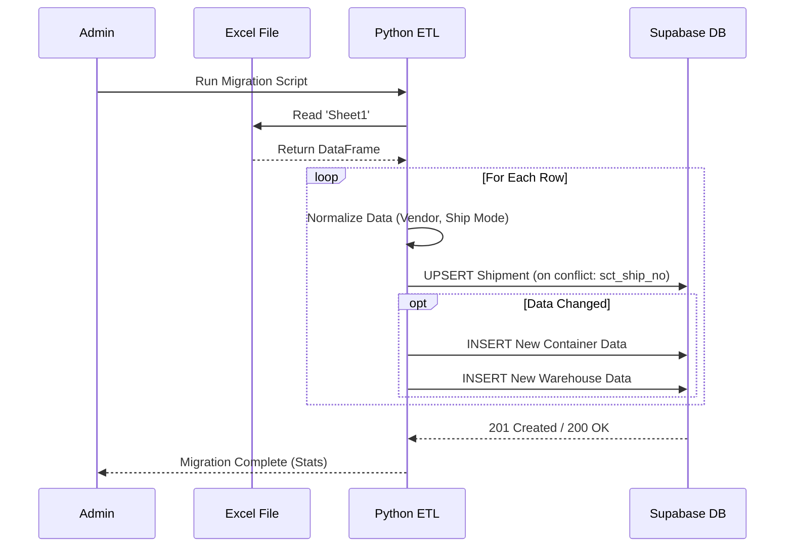
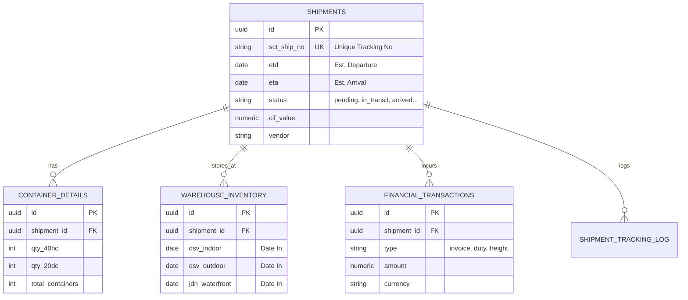
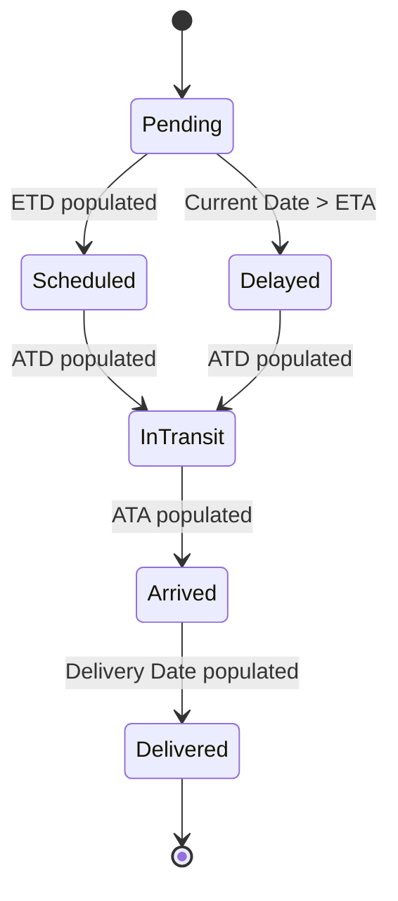

# HVDC Logistics Dashboard - System Architecture

## 1. Overview
The **HVDC Logistics Dashboard** is a web-based platform designed to visualize and manage international shipment data for the Samsung C&T HVDC Project. It centralizes data from Excel-based logistics reports into a relational database, providing real-time tracking, inventory management, and statistical analysis.

---

## 2. High-Level Architecture
The system follows a modern **Jamstack** architecture:
*   **Frontend**: Next.js 15 (Server Side Rendering + Client Components) + PWA Support.
*   **Backend**: Serverless API Routes (Next.js) acting as a gateway to Supabase.
*   **Database**: Supabase (PostgreSQL) with PostgREST APIs.
*   **ETL Pipeline**: Python scripts for data cleaning and migration.



---

## 3. Data Pipeline & Migration Flow
The system synchronizes data from legacy Excel files (`HVDC STATUS_1.xlsx`) to the PostgreSQL database.

**Key Steps:**
1.  **Extraction**: `pandas` reads the Excel file.
2.  **Transformation**:
    *   Data cleaning (whitespace removal, type conversion).
    *   Date parsing (Excel serial dates -> ISO 8601).
    *   Logic mapping (e.g., Status determination based on ATA/Delivery Date).
3.  **Loading**: Upsert operations to `shipments`, followed by re-insertion of `container_details` and `warehouse_inventory`.



---

## 4. Database Schema (ER Diagram)
The database is normalized into central shipment records and related child tables for specific details.



---

## 5. Technology Stack Details

| Component | Technology | Description |
| :--- | :--- | :--- |
| **Framework** | Next.js 15 (App Router) | Core application framework. |
| **Language** | TypeScript | Type-safe development for both frontend and API. |
| **Styling** | Tailwind CSS | Utility-first CSS for responsive UI. |
| **Database** | PostgreSQL (Supabase) | Relational database with Row Level Security (RLS). |
| **ORM / Client** | supabase-js | JavaScript client for database interaction. |
| **ETL Script** | Python (Pandas) | Data processing and migration logic. |
| **Hosting** | Vercel (Recommended) | Optimized hosting for Next.js. |

## 6. Security
*   **Row Level Security (RLS)**: Enabled on all tables. Currently configured to allow authenticated access (service role) for the dashboard and migration script.
*   **Environment Variables**: Sensitive keys (`SUPABASE_SERVICE_ROLE_KEY`) are stored in `.env.local` and never exposed to the client-side bundle.

---

## 7. Additional Diagrams

### 7.1. Shipment State Lifecycle
The status of a shipment transitions automatically based on date fields.



### 7.2. Deployment Infrastructure
```mermaid
graph LR
    subgraph Local_Dev [Local Environment]
        Dev[Developer]
        Code[VS Code]
    end
    
    subgraph GitHub_Repo [GitHub]
        Repo[Source Code]
        Action[GitHub Actions (Future)]
    end
    
    subgraph Vercel_Cloud [Vercel Cloud]
        Build[Build System]
        Edge[Edge Network]
    end
    
    subgraph Supabase_Cloud [Supabase Cloud]
        DB_Inst[PostgreSQL Instance]
        Auth_Svc[Auth Service]
    end

    Dev -->|Push| Repo
    Repo -->|Trigger| Build
    Build -->|Deploy| Edge
    Edge -->|Connect| DB_Inst
```
