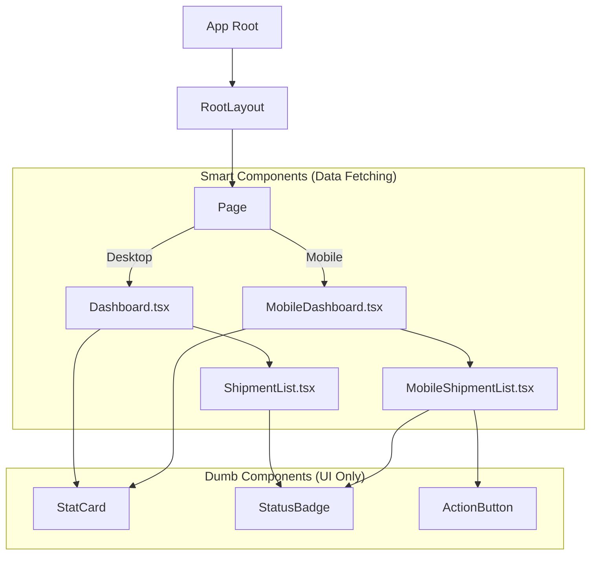

# HVDC Logistics Dashboard - UI/UX Design

## 1. Design Philosophy
The **HVDC Logistics Dashboard** is designed with a **"Mobile-First, Data-Centric"** philosophy. It prioritizes clarity, speed, and accessibility for logistics managers tracking shipments in real-time.

*   **Aesthetics**: Minimalist, professional, and high-contrast for readability in various lighting conditions (office vs. field).
*   **Responsiveness**: Seamless transition between desktop data grids and mobile card-based views.
*   **Interactivity**: Immediate feedback on user actions (hover states, loading spinners, toast notifications).

---

## 2. Design System

### 2.1. Color Palette (Tailwind CSS)
We use a slate-blue based palette to convey trust and stability.

| Role | Tailwind Class | Hex Code | Usage |
| :--- | :--- | :--- | :--- |
| **Primary** | `bg-blue-600` | `#2563EB` | Primary buttons, active tabs, key metrics |
| **Secondary** | `bg-slate-800` | `#1E293B` | Sidebars, headers, dark mode backgrounds |
| **Success** | `bg-green-100` / `text-green-800` | `#DCFCE7` | "Delivered" status, positive trends |
| **Warning** | `bg-yellow-100` / `text-yellow-800` | `#FEF9C3` | "In Transit", "Delayed" alerts |
| **Error** | `bg-red-500` | `#EF4444` | Critical errors, blocked shipments |
| **Background** | `bg-gray-50` | `#F9FAFB` | Main content background |
| **Surface** | `bg-white` | `#FFFFFF` | Cards, modals, tables |

### 2.2. Typography
*   **Font Family**: `Inter` (sans-serif) for clean UI text; `Monospace` for shipment IDs (`sct_ship_no`) to ensure character alignment.
*   **Headings**: Bold, dark gray (`text-gray-900`) for clear hierarchy.
*   **Body**: Regular, slate gray (`text-gray-600`) for readability.

### 2.3. Icons
*   **Library**: `lucide-react`
*   **Style**: Outlined, 1.5px stroke width for a modern look.
*   **Common Icons**: `Ship`, `Package`, `MapPin`, `Calendar`, `AlertTriangle`.

---

## 3. Layout Structure

### 3.1. Desktop Layout (> 768px)
*   **Navigation**: Fixed Top/Side navigation (future expansion).
*   **Dashboard Grid**: 3-column grid for key statistics cards.
*   **Data Table**: Dense table view for `ShipmentList` to show maximum data density.
*   **Action Area**: Top-right for filters, export buttons, and search.

### 3.2. Mobile Layout (< 768px)
*   **Navigation**: Bottom Tab Bar (if expanded) or Hamburger Menu.
*   **Dashboard Stack**: Single-column vertical stack for statistics.
*   **Card List**: `MobileShipmentList` uses broad cards instead of tables to avoid horizontal scrolling.
*   **Touch Targets**: Minimum 44px height for buttons and inputs.

---

## 4. Component Hierarchy

### 4.1. Core Components
*   **Dashboard.tsx**: Container for desktop view. Fetches `/api/statistics` and aggregates data.
*   **MobileDashboard.tsx**: Optimized version of the dashboard. Uses "Quick Stats" and swipeable elements.
*   **ShipmentList.tsx**: HTML `<table>` based. Optimized for sorting and scanning large datasets.
*   **MobileShipmentList.tsx**: `
` based Card layout. Optimized for "glanceability" and touch.

---

## 5. User Interactions & Flows

### 5.1. Filtering Shipments
1.  **User** clicks "Filter" button (Mobile) or dropdown (Desktop).
2.  **System** displays options: Status, Vendor, Date Range.
3.  **User** selects "In Transit".
4.  **System** updates state `statusFilter`.
5.  **Effect** triggers data re-fetch: `/api/shipments?status=in_transit`.
6.  **UI** updates with spinner -> new list.

### 5.2. PWA Installation (Mobile)
1.  **User** visits URL on mobile browser.
2.  **Browser** detects `manifest.json`.
3.  **UI** (or Browser Chrome) shows "Add to Home Screen" prompt.
4.  **User** approves.
5.  **System** installs icon. Opens in standalone mode (no browser bar) on next launch.

---

## 6. Future UX Improvements
*   **Dark Mode**: Native toggle based on system preference.
*   **Skeleton Loading**: Replace spinners with skeleton screens for perceived performance.
*   **Offline Mode**: Cache last known shipment data using Service Worker for field access without signal.
